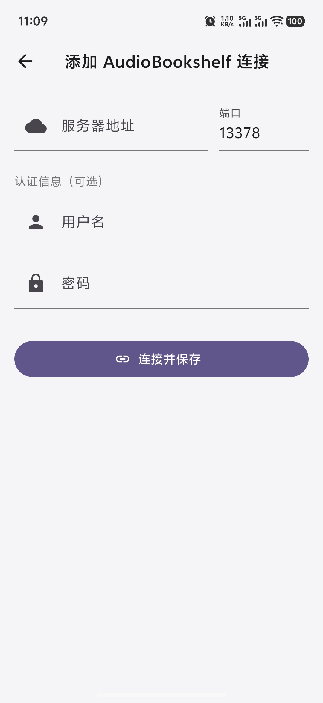
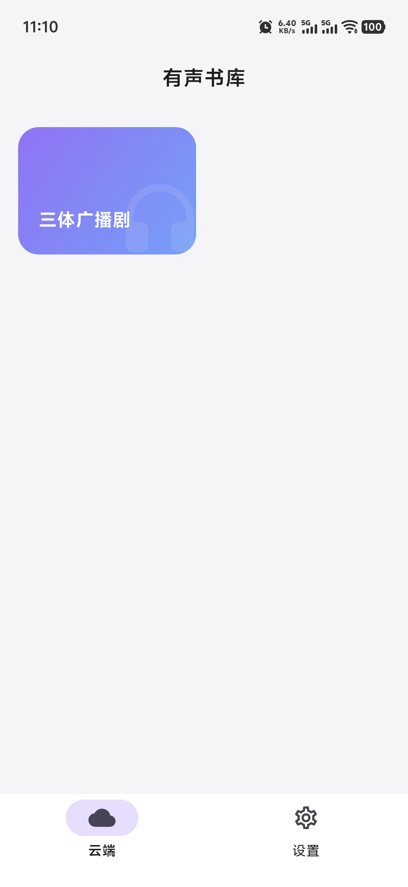
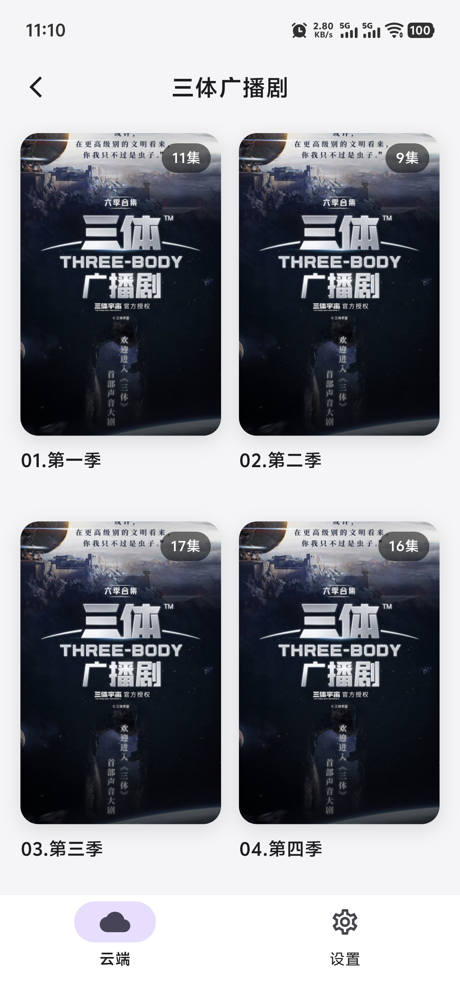
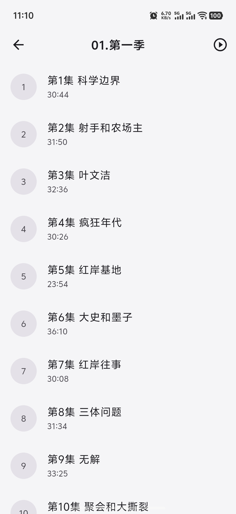
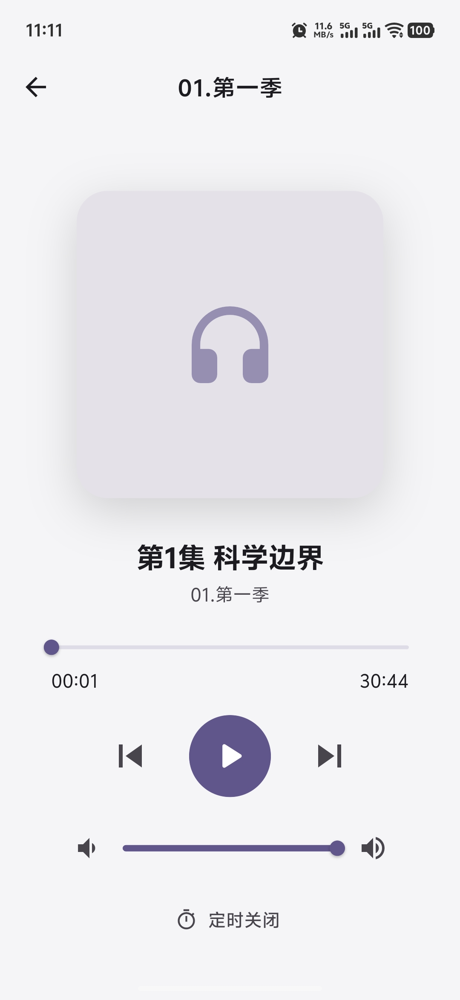

# 有声书播放器

一款基于 Flutter 开发的有声书播放器，支持 AudioBookshelf 远程书库和本地音频文件播放，同时支持 Windows 桌面平台。

## 应用截图

<div align="center">
  
  
  
  
  
</div>

## 功能特性

### 书库
- **AudioBookshelf**：连接 AudioBookshelf 服务器，浏览和播放远程有声书
- **本地书库**：扫描本地目录，自动识别音频文件并归类为书籍（需在设置中开启本地模式）
- **封面显示**：自动加载 AudioBookshelf 书籍封面

### 播放
- **双引擎播放**：just_audio（常规格式）+ media_kit（WMA 等特殊格式）
- **播放控制**：播放/暂停、上一曲/下一曲、进度拖拽
- **播放速度**：支持 0.5x ~ 2.0x 变速播放
- **定时关闭**：15 分钟 / 30 分钟 / 45 分钟 / 1 小时 / 2 小时
- **音量调节**：独立音量控制
- **智能标题**：自动识别 `S01E01`、`EP01` 等格式并显示为「第1集 标题」

### 连接配置
- **简化输入**：服务器地址只需输入 IP，端口单独设置（默认 13378）
- **多连接管理**：支持保存多个 AudioBookshelf 服务器连接

### 界面
- **主题切换**：支持浅色、深色、跟随系统三种模式
- **全局迷你播放栏**：所有页面底部常驻显示，支持播放/暂停和关闭，点击可打开全屏播放器
- **全屏播放器**：封面展示、进度条、控制按钮、音量和定时器
- **Material 3**：采用 Material 3 设计语言
- **桌面适配**：Windows 平台响应式布局，大屏自动增加列数，内容宽度合理约束

### 持久化
- **播放进度记忆**：自动保存播放位置、当前曲目、播放速度和音量，重启后恢复
- **书库配置**：AudioBookshelf 连接信息和本地书库路径持久化存储
- **主题偏好**：主题模式选择自动保存

### 其他
- **用户协议与隐私政策**：设置页面可查看

## 技术栈

- **框架**：Flutter
- **状态管理**：Provider
- **音频播放**：just_audio + media_kit
- **本地存储**：shared_preferences
- **网络请求**：http
- **文件选择**：file_picker
- **权限管理**：permission_handler

## 项目结构

```
lib/
├── main.dart                         # 应用入口
├── models/
│   ├── audio_book.dart               # 有声书模型
│   ├── audio_track.dart              # 音轨模型（含 originalFileName 字段）
│   └── audiobookshelf_config.dart    # ABS 服务器配置模型
├── providers/
│   ├── player_provider.dart          # 播放器状态管理
│   ├── settings_provider.dart        # 应用设置（本地模式开关）
│   └── theme_provider.dart           # 主题状态管理
├── screens/
│   ├── home_shell.dart               # 主页框架（底部导航，支持动态 tab）
│   ├── abs_library_screen.dart       # ABS 远程书库
│   ├── abs_connect_screen.dart       # ABS 连接配置（host + port 分离输入）
│   ├── book_detail_screen.dart       # 书籍详情（曲目列表）
│   ├── player_screen.dart            # 全屏播放器 & 迷你播放栏
│   ├── library_screen.dart           # 本地书库（网格视图）
│   ├── settings_screen.dart          # 设置页面
│   └── policy_screen.dart            # 用户协议与隐私政策
├── services/
│   ├── audio_player_service.dart     # 音频播放服务（双引擎）
│   ├── audiobookshelf_service.dart   # ABS API 客户端
│   ├── playback_storage.dart         # 播放状态持久化
│   ├── folder_scanner.dart           # 本地目录扫描
│   ├── library_storage.dart          # 本地书库路径持久化
│   └── abs_storage.dart              # ABS 配置持久化
└── widgets/
    └── mini_player.dart              # 全局迷你播放器组件
```

## 运行

### 手机端（Android）

```bash
flutter pub get
flutter run
```

### Windows 桌面

```bash
flutter pub get
flutter build windows
./build/windows/x64/runner/Release/audiobook.exe
```

## License

Copyright (c) 2026 shruihu
